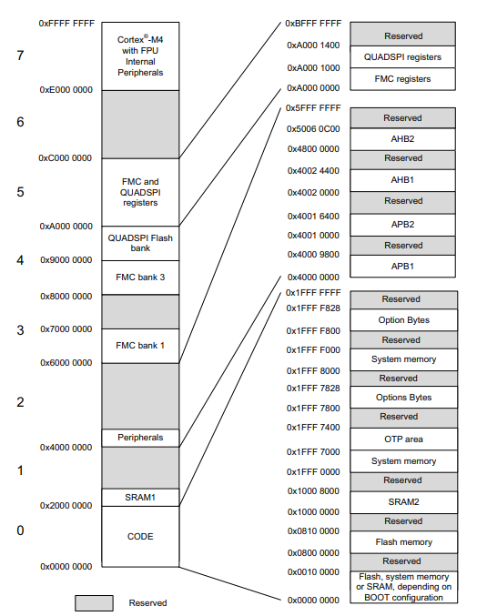

# Banked-Stack-Pointer-Usage

## Concept

* The SRAM stack is divided into 2 part for this example. The SRAM end is the stack start for the MSP.
* The Stack used in the thread mode is PSP and it's points to (MSP - 512 bytes) for this example.
* MSP is the default stack pointer used after reset, and is used for all exception/interrupt handler and for codes which run in thread mode.
* PSP is an alternate stack pointer that can only be used in thread mode.
* SRAM start address : 0x20000000
* SRAm size : 96 KB

* 

## Observation

* When the code starts SP points to the MSP.
* We can change the SP to point to PSP by loading PSP with correct value and then changing the 1st bit of CONTROL register as 1.
* Now in main function (thread mode) we change the SP to point to PSP.
* when the punction is called the PSP is only used.
* But when we generated an exception, it went to exception handler (handler mode) and by default the SP is switched to point to MSP.
* after returning from the handler to main (handler mode to thread mode) the SP will again point to PSP automatically.
* 1st bit of CONTROL registed dont have any effect in handler mode.